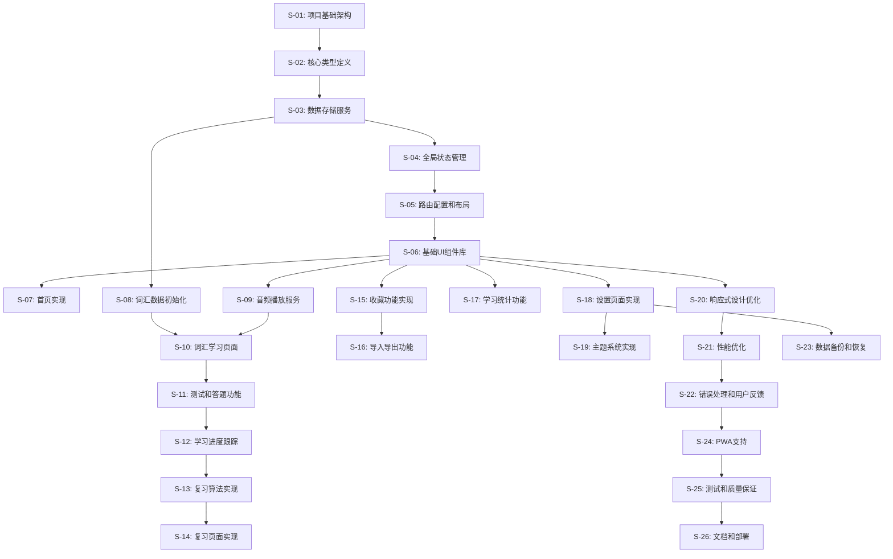

# 自动化开发队列 (Automated Development Queue)

## Epic
构建一个专业的财经英语学习SPA应用，支持分级词汇学习、智能复习、音频朗读、收藏管理和学习统计功能，帮助港美股资讯公司职场人士快速掌握财经英语。

## User Stories (原子任务队列)

### S-01: 项目基础架构搭建
**标题**: 初始化React + TypeScript项目并配置开发环境

**技术规格**:
- 创建文件: `package.json`, `vite.config.ts`, `tsconfig.json`, `tailwind.config.js`
- 创建文件: `.eslintrc.js`, `.prettierrc`, `index.html`
- 创建目录结构: `src/`, `src/components/`, `src/pages/`, `src/hooks/`, `src/services/`, `src/types/`, `src/utils/`
- 安装依赖: React 18, TypeScript, Vite, Tailwind CSS, React Router, ESLint, Prettier

**验收标准 (AC)**:
- [ ] 项目可以通过 `npm run dev` 启动开发服务器
- [ ] TypeScript编译无错误
- [ ] ESLint和Prettier配置正常工作
- [ ] Tailwind CSS样式可以正常应用

---

### S-02: 核心类型定义
**标题**: 定义应用的核心TypeScript接口和类型

**技术规格**:
- 创建文件: `src/types/vocabulary.ts`
- 创建文件: `src/types/user.ts`
- 创建文件: `src/types/collection.ts`
- 创建文件: `src/types/stats.ts`
- 创建文件: `src/types/index.ts`
- 定义接口: `Vocabulary`, `UserProgress`, `Collection`, `DailyStats`, `OverallStats`, `UserSettings`

**验收标准 (AC)**:
- [ ] 所有核心数据模型的TypeScript接口已定义
- [ ] 类型导出正常，可以在其他文件中导入使用
- [ ] 枚举类型 `VocabularyCategory`, `VocabularyLevel`, `MasteryLevel` 已定义
- [ ] TypeScript编译无类型错误

---

### S-03: 数据存储服务层
**标题**: 实现IndexedDB和LocalStorage数据访问服务

**技术规格**:
- 创建文件: `src/services/database.ts`
- 创建文件: `src/services/vocabularyService.ts`
- 创建文件: `src/services/progressService.ts`
- 创建文件: `src/services/collectionService.ts`
- 创建文件: `src/services/statsService.ts`
- 实现类: `DatabaseManager`, `VocabularyService`, `ProgressService`, `CollectionService`, `StatsService`
- 实现方法: 数据库初始化、CRUD操作、数据迁移

**验收标准 (AC)**:
- [ ] IndexedDB数据库可以正常创建和初始化
- [ ] 词汇数据可以正常存储和检索
- [ ] 用户进度数据可以正常更新和查询
- [ ] 收藏集合可以正常创建、修改和删除
- [ ] 学习统计数据可以正常记录和聚合

---

### S-04: 全局状态管理
**标题**: 实现React Context状态管理和Provider组件

**技术规格**:
- 创建文件: `src/contexts/AppContext.tsx`
- 创建文件: `src/contexts/ThemeContext.tsx`
- 创建文件: `src/contexts/AudioContext.tsx`
- 创建文件: `src/reducers/appReducer.ts`
- 实现组件: `AppProvider`, `ThemeProvider`, `AudioProvider`
- 实现Hook: `useAppContext`, `useTheme`, `useAudio`
- 定义Action类型和Reducer逻辑

**验收标准 (AC)**:
- [ ] 全局状态可以在任意组件中访问和修改
- [ ] 主题切换功能正常工作
- [ ] 音频播放状态可以全局管理
- [ ] 状态更新不会导致不必要的组件重渲染

---

### S-05: 路由配置和布局组件
**标题**: 配置React Router并实现应用布局结构

**技术规格**:
- 创建文件: `src/App.tsx`
- 创建文件: `src/components/Layout/Layout.tsx`
- 创建文件: `src/components/Layout/Header.tsx`
- 创建文件: `src/components/Layout/Navigation.tsx`
- 创建文件: `src/components/Layout/Footer.tsx`
- 创建文件: `src/components/common/ErrorBoundary.tsx`
- 配置路由: `/`, `/learn`, `/review`, `/collections`, `/stats`, `/settings`

**验收标准 (AC)**:
- [ ] 所有路由可以正常访问
- [ ] 导航菜单可以正确切换页面
- [ ] 响应式布局在不同屏幕尺寸下正常显示
- [ ] 错误边界可以捕获和显示组件错误

---

### S-06: 基础UI组件库
**标题**: 实现可复用的基础UI组件

**技术规格**:
- 创建文件: `src/components/ui/Button.tsx`
- 创建文件: `src/components/ui/Card.tsx`
- 创建文件: `src/components/ui/Modal.tsx`
- 创建文件: `src/components/ui/Loading.tsx`
- 创建文件: `src/components/ui/ProgressBar.tsx`
- 创建文件: `src/components/ui/Toast.tsx`
- 实现组件样式和交互逻辑

**验收标准 (AC)**:
- [ ] 所有UI组件可以正常渲染和交互
- [ ] 组件支持不同的变体和尺寸
- [ ] 组件样式符合苹果设计风格
- [ ] 组件具有良好的可访问性支持

---

### S-07: 首页实现
**标题**: 实现应用首页和欢迎界面

**技术规格**:
- 创建文件: `src/pages/HomePage.tsx`
- 创建文件: `src/components/Home/WelcomeSection.tsx`
- 创建文件: `src/components/Home/ProgressOverview.tsx`
- 创建文件: `src/components/Home/QuickActions.tsx`
- 实现功能: 学习进度展示、快速开始学习、今日统计

**验收标准 (AC)**:
- [ ] 首页可以正常显示用户学习概况
- [ ] 快速操作按钮可以正确跳转到对应页面
- [ ] 进度数据从本地存储正确加载
- [ ] 页面在移动端和桌面端都有良好的显示效果

---

### S-08: 词汇数据初始化
**标题**: 创建财经词汇数据集并实现数据导入功能

**技术规格**:
- 创建文件: `src/data/vocabularies.json`
- 创建文件: `src/utils/dataInitializer.ts`
- 创建词汇数据: 初级500词、中级800词、高级1200词
- 涵盖分类: stocks, bonds, forex, commodities, macro, financial_reports, abbreviations
- 实现数据导入和初始化逻辑

**验收标准 (AC)**:
- [ ] 词汇数据包含所有必需字段（单词、音标、释义、例句等）
- [ ] 数据按级别和分类正确组织
- [ ] 应用首次启动时可以自动导入词汇数据
- [ ] 数据导入过程有进度提示

---

### S-09: 音频播放服务
**标题**: 实现音频播放功能和语音合成服务

**技术规格**:
- 创建文件: `src/services/audioService.ts`
- 创建文件: `src/hooks/useAudio.ts`
- 创建文件: `src/components/Audio/AudioPlayer.tsx`
- 实现功能: Web Speech API集成、音频播放控制、播放速度调节
- 支持美式和英式发音

**验收标准 (AC)**:
- [ ] 可以播放单词的美式和英式发音
- [ ] 支持正常速度和慢速播放
- [ ] 音频播放状态可以正确显示
- [ ] 在不支持语音合成的浏览器中有降级方案

---

### S-10: 词汇学习页面
**标题**: 实现核心的词汇学习功能页面

**技术规格**:
- 创建文件: `src/pages/LearningPage.tsx`
- 创建文件: `src/components/Learning/LevelSelector.tsx`
- 创建文件: `src/components/Learning/VocabularyCard.tsx`
- 创建文件: `src/components/Learning/WordDisplay.tsx`
- 创建文件: `src/components/Learning/PhoneticDisplay.tsx`
- 创建文件: `src/components/Learning/ExampleSentences.tsx`
- 实现功能: 级别选择、词汇展示、音标显示、例句展示

**验收标准 (AC)**:
- [ ] 用户可以选择学习级别（初级/中级/高级）
- [ ] 词汇卡片可以正确显示单词信息
- [ ] 音标可以正确显示（美式/英式）
- [ ] 例句可以正确展示和朗读

---

### S-11: 测试和答题功能
**标题**: 实现词汇测试和答题反馈功能

**技术规格**:
- 创建文件: `src/components/Learning/TestSection.tsx`
- 创建文件: `src/components/Learning/MultipleChoice.tsx`
- 创建文件: `src/components/Learning/ResultFeedback.tsx`
- 创建文件: `src/utils/testGenerator.ts`
- 实现功能: 选择题生成、答题逻辑、结果反馈、进度更新

**验收标准 (AC)**:
- [ ] 可以为每个词汇生成4选1的选择题
- [ ] 答题结果可以正确判断和反馈
- [ ] 答题数据可以正确记录到用户进度
- [ ] 答题反馈界面友好且信息丰富

---

### S-12: 学习进度跟踪
**标题**: 实现学习进度记录和更新功能

**技术规格**:
- 创建文件: `src/utils/progressTracker.ts`
- 创建文件: `src/utils/masteryCalculator.ts`
- 修改文件: `src/services/progressService.ts`
- 实现功能: 进度计算、掌握度评估、学习记录更新

**验收标准 (AC)**:
- [ ] 用户答题后进度数据可以正确更新
- [ ] 掌握度可以根据答题正确率正确计算
- [ ] 学习历史可以完整记录
- [ ] 进度数据可以持久化存储

---

### S-13: 复习算法实现
**标题**: 实现间隔重复复习算法

**技术规格**:
- 创建文件: `src/utils/reviewAlgorithm.ts`
- 创建文件: `src/utils/scheduler.ts`
- 修改文件: `src/services/progressService.ts`
- 实现算法: 间隔重复、遗忘曲线、复习时间计算

**验收标准 (AC)**:
- [ ] 根据答题正确率可以正确计算下次复习时间
- [ ] 复习间隔符合遗忘曲线规律（1小时、1天、3天、7天）
- [ ] 连续答对8次的词汇可以标记为"完全掌握"
- [ ] 复习队列可以按时间优先级排序

---

### S-14: 复习页面实现
**标题**: 实现词汇复习功能页面

**技术规格**:
- 创建文件: `src/pages/ReviewPage.tsx`
- 创建文件: `src/components/Review/ReviewQueue.tsx`
- 创建文件: `src/components/Review/ReviewCard.tsx`
- 实现功能: 复习队列管理、复习进度显示、批量复习

**验收标准 (AC)**:
- [ ] 可以正确显示待复习词汇列表
- [ ] 复习卡片功能与学习卡片一致
- [ ] 复习进度可以实时更新
- [ ] 复习完成后可以显示统计结果

---

### S-15: 收藏功能实现
**标题**: 实现词汇收藏和收藏夹管理功能

**技术规格**:
- 创建文件: `src/pages/CollectionPage.tsx`
- 创建文件: `src/components/Collection/CollectionList.tsx`
- 创建文件: `src/components/Collection/CollectionDetail.tsx`
- 创建文件: `src/components/Collection/FavoriteButton.tsx`
- 实现功能: 收藏切换、收藏夹创建、收藏夹管理

**验收标准 (AC)**:
- [ ] 用户可以收藏/取消收藏词汇
- [ ] 可以创建自定义收藏夹
- [ ] 收藏夹可以分类管理（单词/句子/自定义）
- [ ] 收藏状态可以在不同页面间同步

---

### S-16: 导入导出功能
**标题**: 实现收藏夹和学习数据的导入导出功能

**技术规格**:
- 创建文件: `src/components/Collection/ImportExport.tsx`
- 创建文件: `src/utils/dataExporter.ts`
- 创建文件: `src/utils/dataImporter.ts`
- 实现功能: JSON格式导出、文件导入、数据验证

**验收标准 (AC)**:
- [ ] 可以将收藏夹导出为JSON文件
- [ ] 可以从JSON文件导入收藏夹数据
- [ ] 导入时可以验证数据格式正确性
- [ ] 导入导出过程有进度提示和错误处理

---

### S-17: 学习统计功能
**标题**: 实现学习数据统计和可视化

**技术规格**:
- 创建文件: `src/pages/StatsPage.tsx`
- 创建文件: `src/components/Stats/DailyChart.tsx`
- 创建文件: `src/components/Stats/ProgressChart.tsx`
- 创建文件: `src/components/Stats/AchievementBadges.tsx`
- 安装依赖: Chart.js 或 Recharts
- 实现功能: 图表展示、统计计算、成就系统

**验收标准 (AC)**:
- [ ] 可以显示每日学习统计图表
- [ ] 可以显示学习进度趋势图
- [ ] 可以显示各级别词汇掌握情况
- [ ] 连续学习天数可以正确计算和显示

---

### S-18: 设置页面实现
**标题**: 实现用户设置和个性化配置

**技术规格**:
- 创建文件: `src/pages/SettingsPage.tsx`
- 创建文件: `src/components/Settings/GeneralSettings.tsx`
- 创建文件: `src/components/Settings/AudioSettings.tsx`
- 创建文件: `src/components/Settings/LearningSettings.tsx`
- 实现功能: 主题切换、音频设置、学习目标设置

**验收标准 (AC)**:
- [ ] 可以切换深色/浅色主题
- [ ] 可以设置发音偏好（美式/英式）
- [ ] 可以调节播放速度
- [ ] 可以设置每日学习目标
- [ ] 设置可以持久化保存

---

### S-19: 主题系统实现
**标题**: 实现完整的深色/浅色主题切换系统

**技术规格**:
- 创建文件: `src/styles/themes.ts`
- 创建文件: `src/components/ui/ThemeToggle.tsx`
- 修改文件: `tailwind.config.js`
- 实现功能: CSS变量主题、自动主题检测、主题持久化

**验收标准 (AC)**:
- [ ] 可以在深色和浅色主题间切换
- [ ] 主题切换动画流畅自然
- [ ] 主题偏好可以保存到本地存储
- [ ] 支持系统主题自动检测

---

### S-20: 响应式设计优化
**标题**: 优化移动端和平板端的响应式体验

**技术规格**:
- 修改文件: 所有组件的CSS样式
- 创建文件: `src/hooks/useMediaQuery.ts`
- 实现功能: 断点适配、触摸交互、移动端导航

**验收标准 (AC)**:
- [ ] 应用在手机端（320px-768px）正常显示
- [ ] 应用在平板端（768px-1024px）正常显示
- [ ] 触摸交互体验良好
- [ ] 移动端导航菜单可以正常使用

---

### S-21: 性能优化
**标题**: 实现应用性能优化和代码分割

**技术规格**:
- 修改文件: `src/App.tsx`
- 创建文件: `src/utils/lazyLoader.ts`
- 实现功能: 路由懒加载、组件懒加载、图片懒加载
- 优化: Bundle分析、Tree shaking、代码压缩

**验收标准 (AC)**:
- [ ] 应用首屏加载时间小于3秒
- [ ] 路由切换响应时间小于500ms
- [ ] 内存使用稳定，无明显内存泄漏
- [ ] 打包后的文件大小合理（主包<500KB）

---

### S-22: 错误处理和用户反馈
**标题**: 实现完善的错误处理和用户反馈系统

**技术规格**:
- 创建文件: `src/utils/errorHandler.ts`
- 创建文件: `src/components/ui/Notification.tsx`
- 修改文件: `src/components/common/ErrorBoundary.tsx`
- 实现功能: 全局错误捕获、用户友好的错误提示、操作反馈

**验收标准 (AC)**:
- [ ] JavaScript错误可以被正确捕获和处理
- [ ] 网络错误有友好的提示信息
- [ ] 用户操作有及时的反馈（成功/失败提示）
- [ ] 错误信息不会暴露技术细节给用户

---

### S-23: 数据备份和恢复
**标题**: 实现用户数据的备份和恢复功能

**技术规格**:
- 创建文件: `src/utils/backupManager.ts`
- 创建文件: `src/components/Settings/DataManagement.tsx`
- 实现功能: 完整数据导出、数据导入、数据清理

**验收标准 (AC)**:
- [ ] 可以导出所有用户数据（学习进度、收藏、设置）
- [ ] 可以从备份文件恢复用户数据
- [ ] 数据导入前有确认提示
- [ ] 可以清除所有本地数据

---

### S-24: PWA支持
**标题**: 添加PWA支持，实现离线可用和应用安装

**技术规格**:
- 创建文件: `public/manifest.json`
- 创建文件: `public/sw.js`
- 创建文件: `src/utils/pwaInstaller.ts`
- 添加图标: 各种尺寸的应用图标
- 实现功能: Service Worker、离线缓存、安装提示

**验收标准 (AC)**:
- [ ] 应用可以离线使用基本功能
- [ ] 用户可以将应用安装到桌面
- [ ] PWA安装提示在合适时机显示
- [ ] 应用图标和启动画面正确显示

---

### S-25: 测试和质量保证
**标题**: 编写单元测试和集成测试

**技术规格**:
- 创建文件: `src/components/__tests__/`目录下的测试文件
- 创建文件: `src/services/__tests__/`目录下的测试文件
- 创建文件: `src/utils/__tests__/`目录下的测试文件
- 配置测试环境: Vitest + React Testing Library

**验收标准 (AC)**:
- [ ] 核心组件有单元测试覆盖
- [ ] 数据服务有单元测试覆盖
- [ ] 工具函数有单元测试覆盖
- [ ] 测试覆盖率达到80%以上
- [ ] 所有测试可以正常运行并通过

---

### S-26: 文档和部署
**标题**: 完善项目文档并配置部署流程

**技术规格**:
- 创建文件: `README.md`
- 创建文件: `DEPLOYMENT.md`
- 创建文件: `CONTRIBUTING.md`
- 配置部署: GitHub Pages 或 Vercel
- 创建构建脚本和CI/CD配置

**验收标准 (AC)**:
- [ ] README包含项目介绍、安装和使用说明
- [ ] 部署文档包含详细的部署步骤
- [ ] 项目可以成功构建和部署
- [ ] 生产环境应用功能正常

---

## 开发依赖关系

## 预估工期
- **Phase 1 (基础架构)**: S-01 到 S-08，预计 2 周
- **Phase 2 (核心功能)**: S-09 到 S-16，预计 3 周
- **Phase 3 (高级功能)**: S-17 到 S-21，预计 2 周
- **Phase 4 (优化完善)**: S-22 到 S-26，预计 1 周

**总预估工期**: 8 周

---

**📋 此开发队列为完整的任务分解，每个Story都是原子性的独立任务。**
**🚀 自动化工程师将严格按照此队列顺序执行开发任务。**