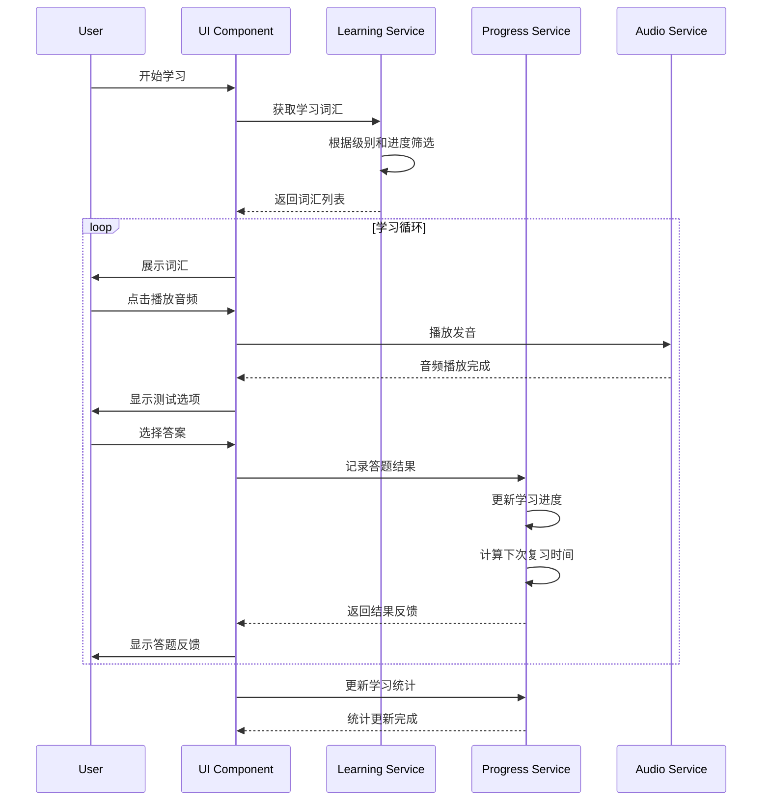
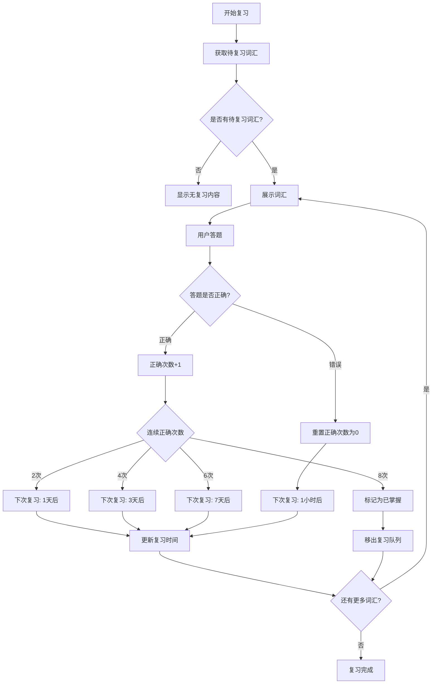
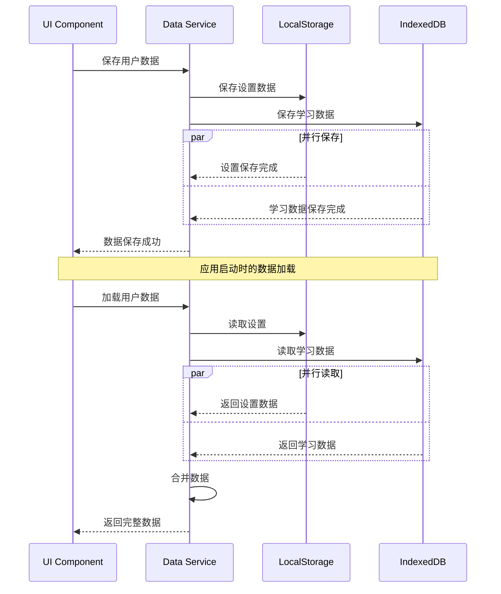

# 架构设计蓝图 (Architecture Blueprint)

## 1. 系统架构概览

### 1.1 整体架构
本系统采用前端单页应用(SPA)架构，基于React 18 + TypeScript构建，数据完全存储在客户端，无需后端服务。

```
┌─────────────────────────────────────────────────────────┐
│                    用户界面层 (UI Layer)                    │
├─────────────────────────────────────────────────────────┤
│                   业务逻辑层 (Business Layer)               │
├─────────────────────────────────────────────────────────┤
│                   数据访问层 (Data Layer)                  │
├─────────────────────────────────────────────────────────┤
│              本地存储 (LocalStorage + IndexedDB)           │
└─────────────────────────────────────────────────────────┘
```

### 1.2 技术栈选型
- **前端框架**: React 18 + TypeScript
- **状态管理**: React Context + useReducer
- **路由管理**: React Router v6
- **样式方案**: Tailwind CSS + CSS Modules
- **音频处理**: Web Audio API + HTML5 Audio
- **数据存储**: LocalStorage + IndexedDB
- **构建工具**: Vite
- **代码规范**: ESLint + Prettier
- **测试框架**: Vitest + React Testing Library

## 2. 数据模型设计

### 2.1 核心数据模型

#### 词汇数据模型 (Vocabulary)
```typescript
interface Vocabulary {
  id: string;                    // 唯一标识符
  word: string;                  // 单词
  phonetic_us: string;           // 美式音标
  phonetic_uk: string;           // 英式音标
  definition_cn: string;         // 中文释义
  definition_en: string;         // 英文释义
  category: VocabularyCategory;  // 词汇分类
  level: VocabularyLevel;        // 难度级别
  examples: string[];            // 例句
  audio_us: string;              // 美式发音音频URL
  audio_uk: string;              // 英式发音音频URL
  tags: string[];                // 标签
  created_at: number;            // 创建时间戳
  updated_at: number;            // 更新时间戳
}

type VocabularyCategory = 
  | 'stocks'              // 股票
  | 'bonds'               // 债券
  | 'forex'               // 外汇
  | 'commodities'         // 商品
  | 'macro'               // 宏观经济
  | 'financial_reports'   // 财报
  | 'abbreviations';      // 缩写词

type VocabularyLevel = 'beginner' | 'intermediate' | 'advanced';
```

#### 用户学习记录模型 (UserProgress)
```typescript
interface UserProgress {
  word_id: string;               // 词汇ID
  correct_count: number;         // 正确次数
  total_attempts: number;        // 总尝试次数
  last_review: number;           // 最后复习时间戳
  next_review: number;           // 下次复习时间戳
  mastery_level: MasteryLevel;   // 掌握程度
  is_favorite: boolean;          // 是否收藏
  first_learned: number;         // 首次学习时间戳
  review_history: ReviewRecord[]; // 复习历史
}

type MasteryLevel = 'learning' | 'reviewing' | 'mastered';

interface ReviewRecord {
  timestamp: number;             // 复习时间戳
  is_correct: boolean;           // 是否正确
  response_time: number;         // 响应时间(毫秒)
}
```

#### 收藏集合模型 (Collection)
```typescript
interface Collection {
  id: string;                    // 集合ID
  name: string;                  // 集合名称
  type: CollectionType;          // 集合类型
  items: string[];               // 项目ID列表
  created_at: number;            // 创建时间戳
  updated_at: number;            // 更新时间戳
  description?: string;          // 描述
  color?: string;                // 主题色
}

type CollectionType = 'words' | 'sentences' | 'custom';
```

#### 学习统计模型 (LearningStats)
```typescript
interface DailyStats {
  date: string;                  // 日期 (YYYY-MM-DD)
  words_learned: number;         // 学习新词数
  words_reviewed: number;        // 复习词数
  time_spent: number;            // 学习时长(分钟)
  accuracy_rate: number;         // 正确率
  sessions: number;              // 学习会话数
}

interface OverallStats {
  total_words_mastered: number;  // 总掌握词汇数
  total_time_spent: number;      // 总学习时长(分钟)
  average_accuracy: number;      // 平均正确率
  current_streak: number;        // 当前连续学习天数
  longest_streak: number;        // 最长连续学习天数
  level_progress: LevelProgress; // 各级别进度
}

interface LevelProgress {
  beginner: {
    learned: number;
    total: number;
  };
  intermediate: {
    learned: number;
    total: number;
  };
  advanced: {
    learned: number;
    total: number;
  };
}
```

#### 用户设置模型 (UserSettings)
```typescript
interface UserSettings {
  pronunciation: 'us' | 'uk';    // 发音偏好
  playback_speed: number;        // 播放速度 (0.5-2.0)
  theme: 'light' | 'dark' | 'auto'; // 主题模式
  daily_goal: number;            // 每日学习目标
  auto_play: boolean;            // 自动播放音频
  show_phonetic: boolean;        // 显示音标
  review_notifications: boolean;  // 复习提醒
  difficulty_level: VocabularyLevel; // 当前学习级别
}
```

### 2.2 IndexedDB 数据库设计

```typescript
// 数据库版本: 1
const DB_NAME = 'FinancialEnglishDB';
const DB_VERSION = 1;

// 对象存储设计
interface DatabaseSchema {
  vocabularies: {
    keyPath: 'id';
    indexes: {
      category: 'category';
      level: 'level';
      word: 'word';
    };
  };
  
  user_progress: {
    keyPath: 'word_id';
    indexes: {
      mastery_level: 'mastery_level';
      next_review: 'next_review';
      is_favorite: 'is_favorite';
    };
  };
  
  collections: {
    keyPath: 'id';
    indexes: {
      type: 'type';
      created_at: 'created_at';
    };
  };
  
  daily_stats: {
    keyPath: 'date';
    indexes: {
      date: 'date';
    };
  };
}
```

## 3. API接口契约

由于本系统为纯前端应用，所有"API"实际为本地数据访问服务。以下定义数据访问接口规范：

### 3.1 词汇管理接口

```typescript
interface VocabularyService {
  // 获取词汇列表
  getVocabularies(params: {
    level?: VocabularyLevel;
    category?: VocabularyCategory;
    limit?: number;
    offset?: number;
  }): Promise<Vocabulary[]>;
  
  // 获取单个词汇
  getVocabulary(id: string): Promise<Vocabulary | null>;
  
  // 搜索词汇
  searchVocabularies(query: string): Promise<Vocabulary[]>;
  
  // 获取随机词汇
  getRandomVocabularies(count: number, level?: VocabularyLevel): Promise<Vocabulary[]>;
}
```

### 3.2 学习进度接口

```typescript
interface ProgressService {
  // 获取用户进度
  getUserProgress(wordId: string): Promise<UserProgress | null>;
  
  // 更新学习记录
  updateProgress(wordId: string, isCorrect: boolean, responseTime: number): Promise<void>;
  
  // 获取需要复习的词汇
  getReviewWords(): Promise<string[]>;
  
  // 获取收藏词汇
  getFavoriteWords(): Promise<string[]>;
  
  // 切换收藏状态
  toggleFavorite(wordId: string): Promise<void>;
}
```

### 3.3 收藏管理接口

```typescript
interface CollectionService {
  // 获取所有收藏集
  getCollections(): Promise<Collection[]>;
  
  // 创建收藏集
  createCollection(name: string, type: CollectionType): Promise<Collection>;
  
  // 添加项目到收藏集
  addToCollection(collectionId: string, itemId: string): Promise<void>;
  
  // 从收藏集移除项目
  removeFromCollection(collectionId: string, itemId: string): Promise<void>;
  
  // 导出收藏集
  exportCollection(collectionId: string): Promise<string>;
  
  // 导入收藏集
  importCollection(data: string): Promise<Collection>;
}
```

### 3.4 统计分析接口

```typescript
interface StatsService {
  // 记录学习会话
  recordLearningSession(wordsLearned: number, timeSpent: number, accuracy: number): Promise<void>;
  
  // 获取每日统计
  getDailyStats(date: string): Promise<DailyStats | null>;
  
  // 获取时间范围统计
  getStatsInRange(startDate: string, endDate: string): Promise<DailyStats[]>;
  
  // 获取总体统计
  getOverallStats(): Promise<OverallStats>;
}
```

## 4. 核心流程图

### 4.1 学习流程



### 4.2 复习算法流程



### 4.3 数据同步流程



## 5. 组件架构设计

### 5.1 组件层次结构

```
App
├── Router
│   ├── Layout
│   │   ├── Header
│   │   │   ├── Navigation
│   │   │   ├── ThemeToggle
│   │   │   └── SettingsButton
│   │   ├── Main
│   │   │   ├── HomePage
│   │   │   │   ├── WelcomeSection
│   │   │   │   ├── ProgressOverview
│   │   │   │   └── QuickActions
│   │   │   ├── LearningPage
│   │   │   │   ├── LevelSelector
│   │   │   │   ├── VocabularyCard
│   │   │   │   │   ├── WordDisplay
│   │   │   │   │   ├── AudioPlayer
│   │   │   │   │   ├── PhoneticDisplay
│   │   │   │   │   └── ExampleSentences
│   │   │   │   ├── TestSection
│   │   │   │   │   ├── MultipleChoice
│   │   │   │   │   └── ResultFeedback
│   │   │   │   └── ProgressBar
│   │   │   ├── ReviewPage
│   │   │   │   ├── ReviewQueue
│   │   │   │   └── ReviewCard
│   │   │   ├── CollectionPage
│   │   │   │   ├── CollectionList
│   │   │   │   ├── CollectionDetail
│   │   │   │   └── ImportExport
│   │   │   ├── StatsPage
│   │   │   │   ├── DailyChart
│   │   │   │   ├── ProgressChart
│   │   │   │   └── AchievementBadges
│   │   │   └── SettingsPage
│   │   │       ├── GeneralSettings
│   │   │       ├── AudioSettings
│   │   │       └── LearningSettings
│   │   └── Footer
│   └── ErrorBoundary
└── Providers
    ├── ThemeProvider
    ├── AudioProvider
    ├── DataProvider
    └── SettingsProvider
```

### 5.2 状态管理架构

```typescript
// 全局状态结构
interface AppState {
  user: {
    settings: UserSettings;
    currentLevel: VocabularyLevel;
    dailyGoal: number;
  };
  
  learning: {
    currentWord: Vocabulary | null;
    sessionWords: Vocabulary[];
    sessionProgress: number;
    isLearning: boolean;
  };
  
  review: {
    reviewQueue: string[];
    currentReviewIndex: number;
    reviewStats: {
      correct: number;
      total: number;
    };
  };
  
  collections: {
    collections: Collection[];
    activeCollection: string | null;
  };
  
  stats: {
    dailyStats: DailyStats | null;
    overallStats: OverallStats;
    isLoading: boolean;
  };
  
  ui: {
    theme: 'light' | 'dark';
    isLoading: boolean;
    error: string | null;
    notifications: Notification[];
  };
}

// Action类型定义
type AppAction = 
  | { type: 'SET_CURRENT_WORD'; payload: Vocabulary }
  | { type: 'UPDATE_PROGRESS'; payload: { wordId: string; isCorrect: boolean } }
  | { type: 'SET_REVIEW_QUEUE'; payload: string[] }
  | { type: 'ADD_COLLECTION'; payload: Collection }
  | { type: 'UPDATE_STATS'; payload: Partial<OverallStats> }
  | { type: 'SET_THEME'; payload: 'light' | 'dark' }
  | { type: 'SET_ERROR'; payload: string | null }
  | { type: 'SET_LOADING'; payload: boolean };
```

### 5.3 关键组件接口

```typescript
// 词汇卡片组件
interface VocabularyCardProps {
  vocabulary: Vocabulary;
  showAnswer: boolean;
  onAnswer: (isCorrect: boolean) => void;
  onFavorite: () => void;
  onPlayAudio: (type: 'us' | 'uk') => void;
}

// 音频播放器组件
interface AudioPlayerProps {
  audioUrl: string;
  playbackSpeed: number;
  autoPlay: boolean;
  onPlayStart: () => void;
  onPlayEnd: () => void;
}

// 进度图表组件
interface ProgressChartProps {
  data: DailyStats[];
  timeRange: 'week' | 'month' | 'year';
  metric: 'words_learned' | 'time_spent' | 'accuracy_rate';
}

// 收藏集管理组件
interface CollectionManagerProps {
  collections: Collection[];
  onCreateCollection: (name: string, type: CollectionType) => void;
  onDeleteCollection: (id: string) => void;
  onExportCollection: (id: string) => void;
  onImportCollection: (data: string) => void;
}
```

## 6. 技术选型与风险评估

### 6.1 关键技术选型

#### 6.1.1 前端框架选择
**选择：React 18 + TypeScript**
- **优势**：
  - 成熟的生态系统和社区支持
  - TypeScript提供强类型检查，减少运行时错误
  - React 18的并发特性提升用户体验
  - 丰富的第三方库支持
- **风险**：
  - 学习曲线相对陡峭
  - 打包体积可能较大

#### 6.1.2 状态管理选择
**选择：React Context + useReducer**
- **优势**：
  - 原生React解决方案，无额外依赖
  - 适合中等复杂度的状态管理
  - 学习成本低
- **风险**：
  - 大规模状态管理可能性能不佳
  - 缺少时间旅行调试等高级功能

#### 6.1.3 数据存储选择
**选择：LocalStorage + IndexedDB**
- **优势**：
  - 完全离线工作
  - 无需服务器成本
  - 数据访问速度快
- **风险**：
  - 存储容量限制
  - 数据可能被用户清除
  - 无法跨设备同步

#### 6.1.4 音频处理选择
**选择：Web Audio API + HTML5 Audio**
- **优势**：
  - 原生浏览器支持
  - 精确的音频控制
  - 支持音频可视化
- **风险**：
  - 浏览器兼容性问题
  - 音频文件加载可能较慢

### 6.2 潜在技术风险

#### 6.2.1 性能风险
- **风险**：大量词汇数据可能影响应用启动速度
- **缓解策略**：
  - 实现懒加载和虚拟滚动
  - 使用Web Workers处理大数据集
  - 实现数据分页和缓存策略

#### 6.2.2 存储风险
- **风险**：浏览器存储限制和数据丢失
- **缓解策略**：
  - 实现数据导出/导入功能
  - 定期提醒用户备份数据
  - 监控存储使用情况

#### 6.2.3 音频风险
- **风险**：音频文件加载失败或播放问题
- **缓解策略**：
  - 实现音频预加载机制
  - 提供降级方案（文本转语音）
  - 添加音频加载状态指示

#### 6.2.4 兼容性风险
- **风险**：不同浏览器的API支持差异
- **缓解策略**：
  - 使用Polyfill处理兼容性
  - 实现特性检测和降级方案
  - 明确支持的浏览器版本

### 6.3 性能优化策略

#### 6.3.1 代码分割
```typescript
// 路由级别的代码分割
const HomePage = lazy(() => import('./pages/HomePage'));
const LearningPage = lazy(() => import('./pages/LearningPage'));
const ReviewPage = lazy(() => import('./pages/ReviewPage'));
```

#### 6.3.2 数据缓存
```typescript
// 实现LRU缓存策略
class VocabularyCache {
  private cache = new Map<string, Vocabulary>();
  private maxSize = 1000;
  
  get(id: string): Vocabulary | undefined {
    const item = this.cache.get(id);
    if (item) {
      // 移到最前面（LRU策略）
      this.cache.delete(id);
      this.cache.set(id, item);
    }
    return item;
  }
  
  set(id: string, vocabulary: Vocabulary): void {
    if (this.cache.size >= this.maxSize) {
      // 删除最久未使用的项
      const firstKey = this.cache.keys().next().value;
      this.cache.delete(firstKey);
    }
    this.cache.set(id, vocabulary);
  }
}
```

#### 6.3.3 虚拟滚动
```typescript
// 大列表虚拟滚动实现
interface VirtualListProps {
  items: any[];
  itemHeight: number;
  containerHeight: number;
  renderItem: (item: any, index: number) => React.ReactNode;
}
```

## 7. 部署与构建策略

### 7.1 构建配置
```typescript
// vite.config.ts
export default defineConfig({
  plugins: [react()],
  build: {
    target: 'es2015',
    outDir: 'dist',
    assetsDir: 'assets',
    sourcemap: true,
    rollupOptions: {
      output: {
        manualChunks: {
          vendor: ['react', 'react-dom'],
          audio: ['tone', 'web-audio-api'],
        },
      },
    },
  },
  optimizeDeps: {
    include: ['react', 'react-dom'],
  },
});
```

### 7.2 PWA支持
```typescript
// 添加Service Worker支持
interface PWAConfig {
  name: 'Financial English Learning';
  short_name: 'FinEng';
  description: '专业财经英语学习应用';
  theme_color: '#2563eb';
  background_color: '#ffffff';
  display: 'standalone';
  start_url: '/';
  icons: IconConfig[];
}
```

## 8. 开发里程碑

### Phase 1: 基础架构 (Week 1-2)
- [ ] 项目初始化和构建配置
- [ ] 基础组件库搭建
- [ ] 路由和状态管理实现
- [ ] 数据存储层实现

### Phase 2: 核心功能 (Week 3-4)
- [ ] 词汇学习功能
- [ ] 音频播放功能
- [ ] 学习进度跟踪
- [ ] 复习算法实现

### Phase 3: 高级功能 (Week 5-6)
- [ ] 收藏和分类管理
- [ ] 统计分析功能
- [ ] 导入导出功能
- [ ] 设置和个性化

### Phase 4: 优化和测试 (Week 7-8)
- [ ] 性能优化
- [ ] 用户体验优化
- [ ] 全面测试
- [ ] 部署和发布

---

**📋 此架构蓝图为完整的技术实施指南，包含所有必要的技术细节和实现策略。**
**🚀 确认无误后，即可基于此蓝图开始自动化开发实施。**